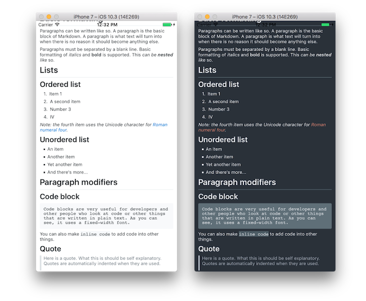

# MarkdownView *for Xamarin.Forms*

A native Xamarin.Forms Markdown renderer.

## Gallery



## Introduction

Compared to a majority of solutions, MarkdownView will render every component as **a native Xamarin.Forms view instead of via an HTML backend.** The Markdown is directly translated from a syntax tree to a hierarchy of Xamarin.Forms views, : no HTML is being produced at all (hurray)!

This will produce a more reactive user interface, at the cost of rendering functionalities *(at the moment though!)*.

## Install

Available on NuGet

[](https://www.nuget.org/packages/Xam.Forms.MarkdownView/)

## Quickstart

```csharp
var view = new MarkdownView();
view.Markdown = "# Hello world\n\nThis is my first native markdown rendering";
view.Theme = new DarkMarkdownTheme(); // Default is white, you also modify various values
this.Content = view;
```

## Limitations

Unfortunately, Xamarin.Forms string rendering has some limitations ...

* **Inlined images aren't supported** (*Xamarin.Forms formatted strings doesn't support inlined views*) : They will be displayed after the block they are referenced from.
* **Links are only clickable at a leaf block level**  (*Xamarin.Forms formatted strings doesn't support span user interactions*) : if a leaf block contains more than one link, the user is prompted. This is almost a feature since text may be too small to be enough precise! ;)
* **SVG rendering is very limited** (*The SVG rendering is based on SkiaSharp which doesn't seem to manage well all svg renderings*)

## Roadmap

* **Customization**
	* [X] Styles 
	* [X] Themes 
* **Leaf blocks**
	* [X] Headings
	* [X] Paragraphs
	* [ ] HTML Blocks (maybe partial and specific support)
	* [ ] Link reference definitions
	* [X] Code blocks
	* [X] Thematic breaks
* **Container blocks**
	* [X] Block quote
	* [X] Lists
		* [ ] Numbers bullet formats
		* [ ] Custom bullets
* **Inlines**
	* [X] Textual content
	* [X] Emphasis and string emphasis
	* [X] Code spans
	* [X] Links (partial, no interaction)
	* [X] Image blocks (partial, not inlined)
		* [X] SVG Rendering (Skia)
* **Extensions**
	* [ ] Table blocks
	* [ ] Emojis (ascii)
	* [ ] Task lists 

## Thanks

* [lunet-io/markdig](https://github.com/lunet-io/markdig) : used for Markdown parsing
* [mono/SkiaSharp](https://github.com/mono/SkiaSharp) : used for SVG rendering

## Contributions

Contributions are welcome! If you find a bug please report it and if you want a feature please report it.

If you want to contribute code please file an issue and create a branch off of the current dev branch and file a pull request.

## License

MIT © [Aloïs Deniel](http://aloisdeniel.github.io)